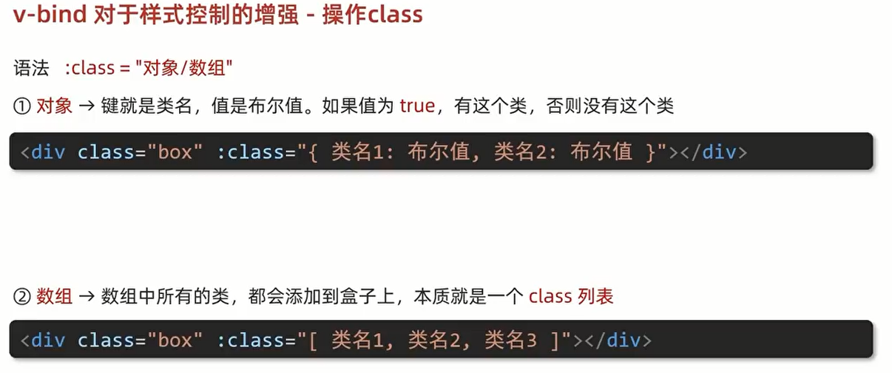
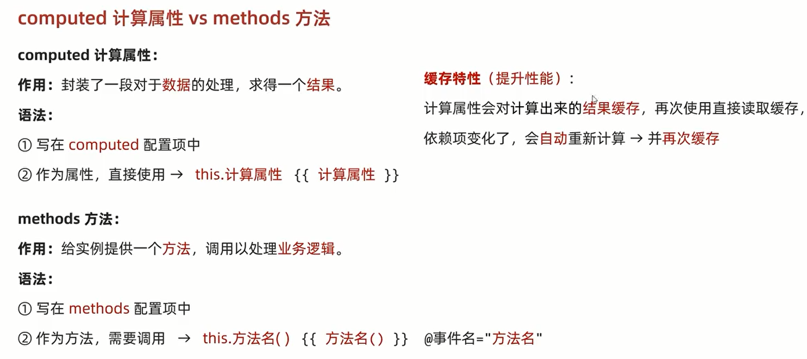
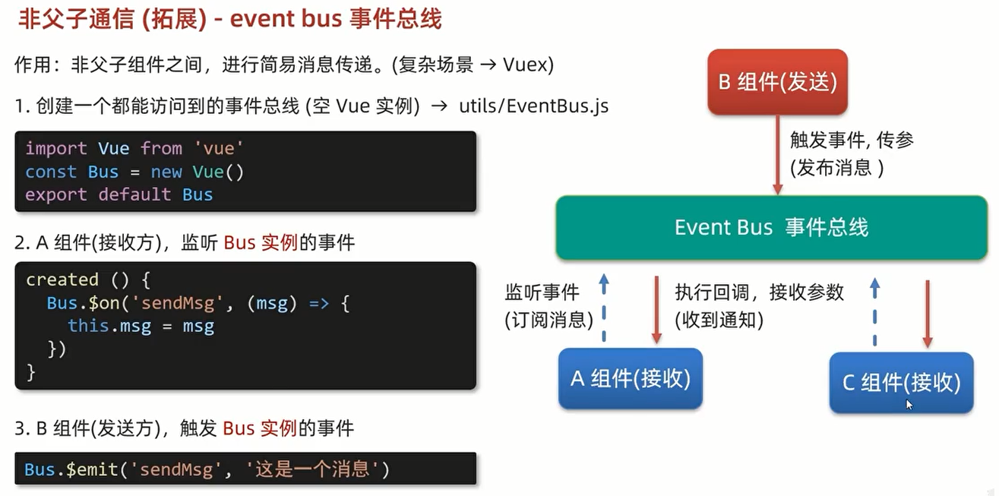
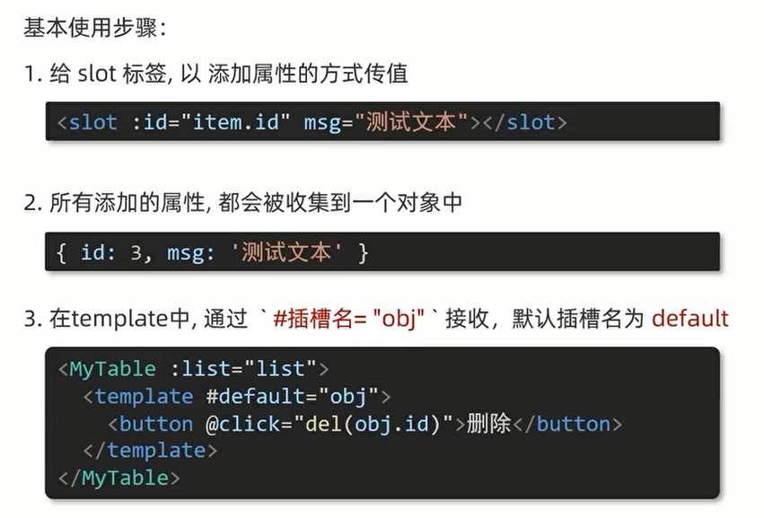

### 指令修饰符
#### 按键修饰符
- @keyup.enter 键盘回车监听
#### v-model修饰符
- v-model.trim 去除空格
- v-model.number 转数字
#### 事件修饰符
- @事件名.stop 阻止冒泡事件
- @事件名.prevent 阻止默认行为

### v-bind的增强


### computed 与 method 的区别

#### 计算属性的完整写法
 ``` javascript
 属性名: {
    get(){
        
    },
    set(val){
        
    }
 }
```
### watch侦听器
```javascript
属性名:{
  deep:true,  // 是否深度监听，true / false
  immediate:true, // 页面一进入，是否立即执行handler方法， true / false
  handler(newVal, oldVal){ // 处理监听事件需要做的事情 
    
  }
}
```

### Vue生命周期
一个Vue实例从创建到销毁的整个过程。从开始创建、初始化数据、编译模板、挂在dom结构、渲染、更新、卸载等一系列过程。
#### 创建阶段
准备数据
- beforeCreate
  在该阶段，数据观测和初始化事件还未开始，此时data的响应式追踪、watch、event都没有被设置，在这个阶段，无法访问data、computed、watch、methods的方法和数据。
  
- <font color='red'>created</font>
  此时，实例创建完成，比如data、computed、watch、methods等，但是还未将渲染渲染的节点挂载到dom上，不能访问$el。
  
#### 挂载阶段
渲染模板
- beforeMount
  挂在开始之前调用，相关的render函数首次被调用，实例已完成模板的编译、将data里的数据和模板生成html。此时，html未被渲染到页面。
  
- mounted
  el被新的vm.$el替换，并挂载到实例上。此时，编译好的html替换el指向的dom对象，完成模板中的html渲染到页面上的html。
  
#### 更新阶段
修改数据，更新视图
- beforeUpdate
  响应式数据更新时调用，此时，只是数据更新，对应的真是dom还未更新。
- updated
  数据更新后，dom根据响应式数据变化更新。依赖此dom的操作也可以被执行。该钩子函数在服务器渲染期间不被调用。
#### 销毁阶段
销毁实例
- beforeDestroy
  实例销毁之前，this仍可以获取实例
- destroyed
  实例销毁后，vue绑定的所有东西都被销毁，所有事件监听都被移除，所有子实例也被销毁。

#### keep-alive
keep-alive 有独有的生命周期，分别为 activated 和 deactivated。用 keep-alive 包裹的组件在切换时不会进行销毁，而是缓存到内存中并执行 deactivated 钩子函数，命中缓存渲染后会执行 activated 钩子函数。

#### Vue 子组件和父组件执行顺序
##### 加载渲染过程：
    1.父组件 beforeCreate
    2.父组件 created
    3.父组件 beforeMount
    4.子组件 beforeCreate
    5.子组件 created
    6.子组件 beforeMount
    7.子组件 mounted
    8.父组件 mounted
##### 更新过程：
    1. 父组件 beforeUpdate
    2.子组件 beforeUpdate
    3.子组件 updated
    4.父组件 updated
##### 销毁过程：
    1.父组件 beforeDestroy
    2.子组件 beforeDestroy
    3.子组件 destroyed
    4.父组件 destroyed

### Vue工程化开发
#### 创建项目
创建项目 -- vue create 项目名称 （项目名不可为中文）

#### main.js 说明
作用：导入App.vue，基于App.vue创建结构渲染html
```js
// 1、导入 Vue 核心包
import Vue from 'vue'

// 2、导入App.vue 根组件 
import App from './App.vue'

// 提示当前处于什么环境（生产/开发）
Vue.config.production = false

// 3、Vue实例化，提供render方法 -> 基于App.vue 创建结构渲染index.html
new Vue({
// el: '#app', // 作用和.mount('选择器')一致，用于指定Vue所管理的容器
render: h=>h(App)
/*
render完整写法：
render: (createElement)=>{
  return createElement(App);
}
*/
}).mount('#app')
```

#### 组件化开发
一个页面可以拆分成多个组件，每个组件分成三部分：
- template ：架构
- script：逻辑
- style：样式

##### 组件注册方式
- 全局注册 
  在main.js中引入组件
  ```js
  // 导入组件
  import 组件名 from '组件位置'
  // 注册组件
  Vue.componet('组件命名', 组件)
  ```
- 局部注册
  在使用该组件的文件中导入
  ```js
  <script>
    // 导入组件 
    import 组件名 from '组件位置'
    export default {
    // 注册组件
      components:{
          组件名: 组件
      } 
    }
  </script>
  ```

#### style中scoped的作用及原理
作用： 
默认的style样式是作用于全局，加上scoped属性的style样式只回作用于当前组件，属于局部样式。

原理
- 当前组件摸板的所有元素都会被加上一个自定义属性 data-v-hash值，根据hash值区分不同的组件。
- css选择器后面会被自动处理，添加属性选择器， 例如：div[data-v-hash值]。

#### 组件之间的通信
组件通信就是组件与组件之间的数据传递。
##### props --- $emit
父传子 props
 父组件中使用自定义属性传递值，子组件通过props接受相应属性的值
###### props校验
- 类型校验 
  ```js
  props:{
    校验属性名: 类型
  }
  ```

- 非空校验
- 默认值
- 自定义校验
```js
  校验属性名:{
    type: 类型, // Number String Boolean Object
    required: true, // false
    default: 默认值, //
    validator(value){
      // 一些自定义校验
      return true; //false
    }
  }
```
```js
  // 父组件中的内容
  <Son :title='myTitle'/>
  
  data(){
    return {
      myTitle:'传递的内容'
    }
  }
  // 子组件中的内容
  export default{
    props: ['title'] // 通过props接受myTitle的值
  }
```
子传父 $emit
```js
  // 父组件中的内容
  <Son :title='myTitle' @changeTitle='handleChange'/>
  data(){
    return {
      myTitle:'传递的内容'
    }
  },
  methods:{
    handleChange(newValue){
      this.myTitle = newValue
    }
  }
  // 子组件中的内容
  <button @click='changeFn'></button>
  export default{
    // props: ['title'] // 通过props接受myTitle的值,
    // props 验证
    props:{
      title: String
    }
    
    methods:{
      changeFn(){
        this.$emit('changeTitle', '新传递的值')
      }
    }
  }
```
##### provide & inject
非父子组件之间的通信，跨层级共享数据。
- 父组件：provide 提供数据
- 子/孙组件：inject 取值使用

##### event bus
全局事件总线：非父子组件之间的消息传递。

##### Vuex

#### v-model
双向数据绑定，原理：
```vue
<!-- 下面两个等价 -->
<input v-model="value"/>  
<input :value="value" @input="value = $event.target.value"/>
```

#### ref &&　$refs
来获取dom元素或者组件实例，查找范围是当前组件内的元素。
##### 获取dom元素
- 给目标标签加上ref属性
  ```html
  <div ref="div1"></div>
  ```
- 获取目标标签
  ```vue
  mounted(){
    this.$refs.div1
  }
  ```
##### 获取组件实例
- 给目标组件加上ref属性
  ```html
  <BaseForm ref="baseForm"></BaseForm>
  ```
- 获取目标组件，调用其方法
  ```vue
  mounted(){
    this.$refs.baseForm.方法
  }
  ```

#### Vue异步更新
$nextTick : 等dom更新完之后才会触发该方法里的函数体

#### 自定义指令
封装 一些dom操作，扩展额外功能
- 全局注册
  ```vue
  Vue.directive('指令名',{
    "inserted"(el){
      el.focus() // 某个功能
    }
  })
  ```
- 局部注册
  ```vue
  directives:{
    '指令名':{
        inserted(){
          el.focus() // 某个功能
        }
     }
  }
  ```
使用：
```html
  <input v-指令名 type="text"/>
```

##### v-loading
- 准备一个类名loading，通过伪元素提供遮罩层
- 添加或移除类名，实现loading蒙层的添加删除
- 利用指令语法，封装v-loading通用指令
  - inserted 钩子中，binding.value判断指令的值，设置默认状态
  - update 钩子中，binding.value判断指令的值，更新类名状态
  
#### 插槽
##### 默认插槽
组件内定制一处结构
##### 具名插槽
组件内定制多处结构
- 使用slot进行占位，用name属性区分
- 使用template配合v-slot:插槽名 分发内容。（v-slot:插槽名可以简化为 #插槽名）
##### 作用域插槽
定义slot插槽的同时，是可以传值的。给插槽上绑定数据，将来使用组件时可以使用。
- 给slot标签，以添加属性的方式进行传值
  丰富
- 


#### 路由VueRouter
##### 五个步骤：

* 下载VueRouter模块
  
  ```npm i 'vue-router'```
* 引入：
  
  ```import VueRouter from 'vue-router'```
* 安装注册：
  
  ```Vue.use(VueRouter)```
* 创建路由对象： 
  
    ```const router = new VueRouter()```
* 注入，将路由对象注入到new Vue实例当中，建立关联
  ```javascript
  new Vue({
    render: h=>h(app),
    router
  }).$mount('#app')
  ```
##### 路由配置规则
```javascript
const router = new VueRouter({
  routes:[
    {
      path: '路径', componet: 组件名
    }
  ]
})
```
使用时，配置路径以及需要展示的位置，使用<router-view></router-view>占位+
